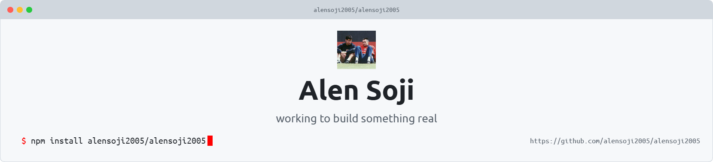

  <picture>
    <source media="(prefers-color-scheme: dark)" srcset="art/header-dark.png">
    
  </picture>

    

  

  

    
    
    
  

---

### 🚀 Featured Projects

<table width="100%" align="center">
  <tr>
    <td width="50%" valign="top">
      <h3 align="left">
        <a href="https://github.com/alensoji2005/Saute-Bot">🍳 Saute-Bot</a>
      </h3>
      
An All in 1 AI Cooking Assistant.

      

        
        
      

    </td>
    <td width="50%" valign="top">
      <h3 align="left">
        <a href="https://github.com/alensoji2005/tenderai">🤖 tenderai</a>
      </h3>
      
ML-driven bid optimization platform for scraping, analyzing and managing public tender opportunities.

      

        
        
      

    </td>
  </tr>
</table>

  
   
  <b>Companion:</b> Charizard (Lvl. 51)

---

### 📖 Visitor Guestbook

  Leave a note, feedback, or say hi!
    
  

<!-- GUESTBOOK-START -->
<!-- GUESTBOOK-END -->

---

### 🎮 Activity Garden

  <picture>
    <source media="(prefers-color-scheme: dark)" srcset="https://raw.githubusercontent.com/alensoji2005/alensoji2005/output/github-snake-dark.svg" />
    <source media="(prefers-color-scheme: light)" srcset="https://raw.githubusercontent.com/alensoji2005/alensoji2005/output/github-snake.svg" />
    
  </picture>

